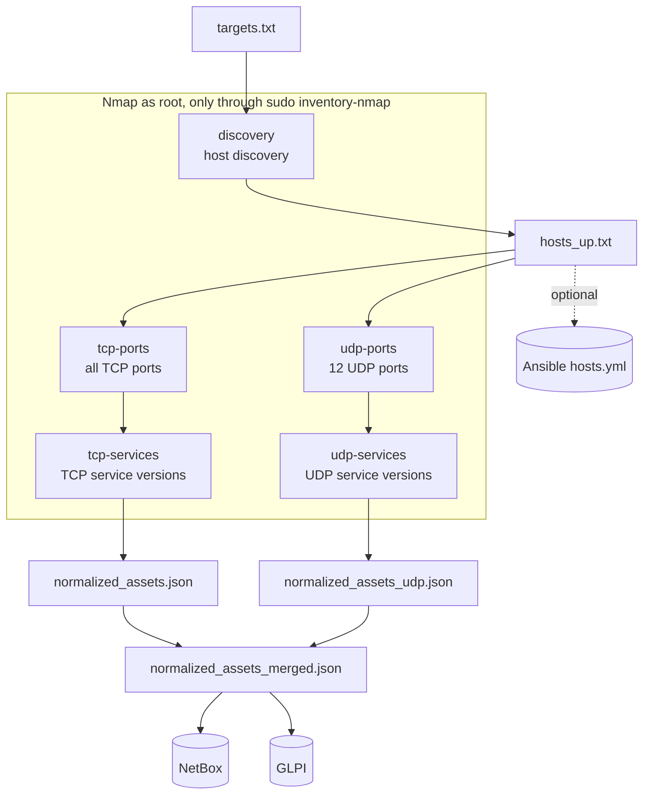

# Architecture

## Purpose

The pipeline keeps a network inventory up to date without manual work: it scans the
configured subnets, rebuilds the list of ports and services of every host and writes
the result to the systems where the organization already manages its network and assets.

Every run is a snapshot of the network at that moment: the pipeline adds and updates,
but never deletes (see [Known limitations](#known-limitations)).

## Components

| Component | Role in the pipeline | Required |
|---|---|---|
| Nmap | Collects the data: live hosts, TCP/UDP ports, services and versions | Yes |
| `deploy/inventory-nmap` | Wrapper that runs Nmap as root with five fixed profiles | Yes |
| Python scripts in `nmap/scripts/` | Parse the Nmap XML, normalize, merge and send to NetBox and Ansible | Yes |
| NetBox | Destination: one *IP Address* per host, with three custom fields | No (`PUSH_TO_NETBOX=false`) |
| GLPI | Destination: one `Nmap` custom asset per host | No (`PUSH_TO_GLPI=false`) |
| Ansible | Destination: discovered hosts are added to a `hosts.yml` | No (empty `ANSIBLE_INVENTORY_FILE`) |

## Data flow



Everything starts from `nmap/run_all_inventory.sh`, which runs in sequence:

| Phase | Script | What it does | Main output |
|---|---|---|---|
| 1. Host discovery | `run_inventory.sh` | `discovery` profile on `targets.txt`: finds the hosts that respond | `scans/hosts_up_<date>.xml`, `work/hosts_up_<date>.txt` |
| 1b. Ansible | `run_inventory.sh` | If configured, adds the hosts found to `hosts.yml` | the file set in `ANSIBLE_INVENTORY_FILE` |
| 2. TCP ports | `run_inventory.sh` | `tcp-ports` profile: all 65,535 TCP ports of the hosts found | `scans/open_ports_<date>.xml` |
| 3. TCP services | `run_inventory.sh` | `tcp-services` profile: identifies service and version on the open ports | `scans/services_<date>.xml`, `work/normalized_assets_<date>.json` |
| 4. UDP ports | `run_udp_enrichment.sh` | `udp-ports` profile: 12 significant UDP ports | `scans/open_ports_udp_<date>.xml` |
| 5. UDP services | `run_udp_enrichment.sh` | `udp-services` profile on the candidate UDP ports | `scans/services_udp_<date>.xml`, `work/normalized_assets_udp_<date>.json` |
| 6. Merge | `run_udp_enrichment.sh` | Merges TCP and UDP into a single JSON per host | `work/normalized_assets_merged_<date>.json` |
| 7. NetBox | `run_all_inventory.sh` | Creates or updates the IP Addresses | log `logs/netbox_sync_<date>.log` |
| 8. GLPI | `run_all_inventory.sh` | Creates or updates the `Nmap` assets | log `logs/glpi_sync_<date>.log` |

If phase 1 finds no hosts, the pipeline stops successfully without touching NetBox and
GLPI. If phase 2 finds no open TCP ports, phase 3 is skipped; if phase 4 finds no
candidate UDP ports, phases 5 and 6 reduce to a copy of the TCP JSON. Phases 7 and 8
are independent: a failure in one does not block the other.

### Privilege separation

Only the five Nmap scans run as root, and only through the wrapper
`/usr/local/sbin/inventory-nmap`. Everything else (bash and Python scripts, file reads
and writes, API calls) runs as the unprivileged service user. The wrapper receives the
targets on standard input and returns the XML on standard output: the user's scripts
read `targets.txt` and write the files in `scans/`, so Nmap running as root never opens
a file. Details in [Security](security.md).

## Repository layout

```
.
├── README.md                     # quick start
├── LICENSE                       # MIT license
├── .gitattributes                # forces LF line endings (the scripts do not run with CRLF)
├── .gitignore                    # excludes configuration, scans, logs and local state
├── deploy/
│   ├── inventory-nmap            # root wrapper: the only command allowed through sudo
│   └── sudoers-inventory         # sudo rule restricted to the wrapper
├── docs/                         # this documentation
├── glpi-nmap-adapter/
│   ├── .env.example              # GLPI configuration template
│   ├── nmap_to_glpi_nmap_asset.py  # push to GLPI (Legacy API)
│   └── requirements.txt          # requests, python-dotenv
└── nmap/
    ├── netbox.env.example        # NetBox, Ansible and pipeline options template
    ├── requirements.txt          # requests, PyYAML
    ├── run_all_inventory.sh      # entry point: runs the whole pipeline
    ├── run_inventory.sh          # phases 1-3 (hosts, TCP ports and services)
    ├── run_udp_enrichment.sh     # phases 4-6 (UDP ports and services, merge)
    ├── targets.txt.example       # scan targets template
    └── scripts/
        ├── build_portspec_from_xml.py   # open ports -> port list for the service phase
        ├── extract_hosts.py             # host discovery XML -> one IP per line
        ├── extract_open_ports.py        # ports XML -> JSON for reference
        ├── merge_assets_json.py         # TCP + UDP merge
        ├── normalize_for_netbox.py      # three XML files -> normalized per-host JSON
        ├── push_to_netbox.py            # push to NetBox
        └── update_ansible_hosts_yml.py  # Ansible hosts.yml update
```

## Files generated by each run

All paths are relative to `/opt/inventory`. The `nmap/scans/`, `nmap/work/` and
`nmap/logs/` directories are created on the first run and are excluded from git.

| File | Produced by | Contents |
|---|---|---|
| `nmap/scans/hosts_up_<date>.xml` | phase 1 | Nmap XML of the host discovery |
| `nmap/scans/open_ports_<date>.xml` | phase 2 | Nmap XML of the full TCP scan |
| `nmap/scans/services_<date>.xml` | phase 3 | Nmap XML of the TCP service detection (only if there are open ports) |
| `nmap/scans/open_ports_udp_<date>.xml` | phase 4 | Nmap XML of the UDP scan |
| `nmap/scans/services_udp_<date>.xml` | phase 5 | Nmap XML of the UDP service detection (only if there are candidate ports) |
| `nmap/work/hosts_up_<date>.txt` | phase 1 | One IP per line: the hosts to scan in the following phases |
| `nmap/work/open_ports_<date>.json` | phase 2 | Open TCP ports per host, as JSON. Not used by later phases: kept for reference |
| `nmap/work/open_ports_udp_<date>.json` | phase 4 | Same, for UDP |
| `nmap/work/normalized_assets_<date>.json` | phase 3 | Normalized JSON, TCP only |
| `nmap/work/normalized_assets_udp_<date>.json` | phase 5 | Normalized JSON, UDP only (empty if no candidate ports) |
| `nmap/work/normalized_assets_merged_<date>.json` | phase 6 | Final JSON sent to NetBox and GLPI |
| `nmap/logs/*.log` | all | See [Running → Logs](running.md#logs) |
| `glpi-nmap-adapter/glpi_nmap_state_legacy.json` | phase 8 | IP → GLPI asset ID mapping |

When the pipeline runs again on the same day, the files in `scans/` and `work/` are
overwritten and the logs are appended to.

## Data formats

### Normalized JSON

`normalized_assets_<date>.json`, `normalized_assets_udp_<date>.json` and
`normalized_assets_merged_<date>.json` share the same structure:

```json
{
  "assets": [
    {
      "ip": "192.0.2.10",
      "hostname": null,
      "services": [
        {
          "port": 22,
          "protocol": "tcp",
          "state": "open",
          "name": "ssh",
          "product": "OpenSSH",
          "version": "9.x",
          "extrainfo": "protocol 2.0"
        },
        {
          "port": 161,
          "protocol": "udp",
          "state": "open|filtered",
          "name": "snmp",
          "product": null,
          "version": null,
          "extrainfo": null
        }
      ]
    }
  ]
}
```

| Field | Meaning |
|---|---|
| `ip` | IPv4 address of the host |
| `hostname` | Host name if the target in `targets.txt` was written as a name, otherwise `null` (the scans use `-n`, with no DNS resolution) |
| `services[].port` | Port number |
| `services[].protocol` | `tcp` or `udp` |
| `services[].state` | `open`; for UDP also `open\|filtered` (no response: the port may be open or filtered by a firewall) |
| `services[].name` | Service name according to Nmap (`ssh`, `http`, `domain`…) |
| `services[].product`, `version`, `extrainfo` | Product, version and extra information detected with `-sV`, or `null` |

Hosts are sorted by IP (as text), services by port and protocol. When two scans report
the same port and protocol, the entries are merged: the `open` state wins over
`open|filtered`, and non-empty descriptive fields from the later scan (the service
scan) replace the earlier ones.

### GLPI state file

`glpi_nmap_state_legacy.json` maps every IP to the ID of the asset created in GLPI, so
later runs update the asset instead of creating a new one:

```json
{
  "192.0.2.10": 101,
  "192.0.2.20": 102
}
```

## How the data looks in the destinations

### NetBox

For every host the pipeline manages an *IP Address* `192.0.2.10/32`. The three custom
fields are written on every run; the other fields only when the IP is created, so
values curated by hand on an existing IP are left untouched.

| NetBox field | Value | When |
|---|---|---|
| `address` | IP with a `/32` mask | on creation |
| `status` | `active` | on creation |
| `dns_name` | `hostname`, if present | on creation |
| `description` | `Nmap scan` | on creation |
| `tcp_ports` (custom field) | `22, 80, 443` | always |
| `udp_ports` (custom field) | `53, 161?`: the `?` marks an `open\|filtered` port | always |
| `services_detail` (custom field) | one service per line, separated by a blank line, for example `SSH (22/tcp) - OpenSSH 9.x` | always |

The formatting and filtering rules for services are in
[Script reference → push_to_netbox.py](script-reference.md#scriptspush_to_netboxpy).

### GLPI

For every host the pipeline manages an asset of the `Nmap` custom type:

| GLPI field | Value |
|---|---|
| `name` | the IP, for example `192.0.2.10` |
| TCP ports field | `22,80,443` |
| UDP ports field | `53,161` |
| services field | one service per line, for example `• 22/ssh [OpenSSH 9.x protocol 2.0]` |

Unlike NetBox, in GLPI every port appears in the services field (including those with
an `unknown` service) and `open|filtered` UDP ports are not marked.

### Ansible

The file set in `ANSIBLE_INVENTORY_FILE` is created if missing and updated if present:

```yaml
all:
  vars: {}
  hosts:
    192.0.2.10: {}
    192.0.2.20: {}
```

Existing hosts and their variables are kept; new ones are added under `all.hosts`. The
file is rewritten in full: any comments are lost.

## Known limitations

- **IPv4 only.** IPv6 addresses in the Nmap XML are ignored.
- **No removal.** A host that disappears from the network stays in NetBox, GLPI and
  Ansible with the last data seen: the pipeline does not record a "last seen" date.
- **NetBox: exact `/32` match.** An IP already registered in NetBox with its subnet
  mask (for example `192.0.2.10/24`) is not recognized, and the pipeline creates a
  second `192.0.2.10/32` record. VRFs are not taken into account: if the same address
  exists in several VRFs, the first match is updated.
- **GLPI: deduplication relies on the state file.** If `glpi_nmap_state_legacy.json`
  is lost, the pipeline creates new assets for every host instead of updating the
  existing ones.
- **Host names only for targets given by name.** The scans do not query DNS.
- **No exclusions.** Single hosts cannot be excluded from a subnet in `targets.txt`:
  list only the ranges to include.
- **TCP services scanned on the union of ports.** Phase 3 probes, on every host, all the
  ports found open on at least one host. Ports closed on a given host do not show up in
  the results, but the traffic grows with the variety of services on the network.
- **UDP on 12 ports.** A full UDP scan would be too slow; the list can be changed (see
  [Configuration](configuration.md#settings-fixed-in-the-code)).
