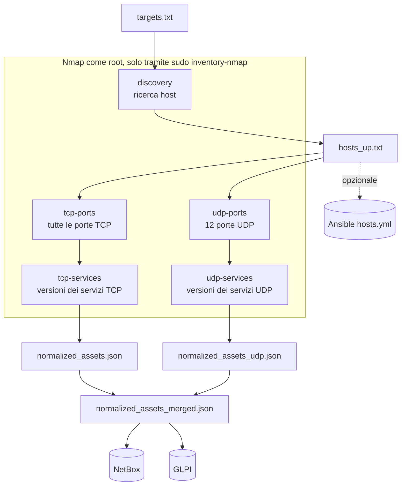

# Architettura

## Scopo

La pipeline mantiene aggiornato un inventario di rete senza intervento manuale:
scansiona le subnet indicate, ricostruisce per ogni host l'elenco di porte e servizi
e scrive il risultato nei sistemi dove l'organizzazione già gestisce rete e asset.

Ogni esecuzione è una fotografia della rete in quel momento: la pipeline aggiunge e
aggiorna, ma non cancella (vedi [Limiti noti](#limiti-noti)).

## Componenti

| Componente | Ruolo nella pipeline | Obbligatorio |
|---|---|---|
| Nmap | Raccoglie i dati: host attivi, porte TCP/UDP, servizi e versioni | Sì |
| `deploy/inventory-nmap` | Wrapper che esegue Nmap come root con cinque profili fissi | Sì |
| Script Python in `nmap/scripts/` | Leggono l'XML di Nmap, normalizzano, uniscono e inviano a NetBox e Ansible | Sì |
| NetBox | Destinazione: un *IP Address* per host, con tre campi personalizzati | No (`PUSH_TO_NETBOX=false`) |
| GLPI | Destinazione: un asset personalizzato `Nmap` per host | No (`PUSH_TO_GLPI=false`) |
| Ansible | Destinazione: gli host scoperti vengono aggiunti a un `hosts.yml` | No (`ANSIBLE_INVENTORY_FILE` vuota) |

## Flusso dei dati



Tutto parte da `nmap/run_all_inventory.sh`, che esegue in sequenza:

| Fase | Script | Cosa fa | Output principale |
|---|---|---|---|
| 1. Ricerca host | `run_inventory.sh` | Profilo `discovery` su `targets.txt`: trova gli host che rispondono | `scans/hosts_up_<data>.xml`, `work/hosts_up_<data>.txt` |
| 1b. Ansible | `run_inventory.sh` | Se configurato, aggiunge gli host trovati a `hosts.yml` | il file indicato in `ANSIBLE_INVENTORY_FILE` |
| 2. Porte TCP | `run_inventory.sh` | Profilo `tcp-ports`: tutte le 65.535 porte TCP degli host trovati | `scans/open_ports_<data>.xml` |
| 3. Servizi TCP | `run_inventory.sh` | Profilo `tcp-services`: riconosce servizio e versione sulle porte aperte | `scans/services_<data>.xml`, `work/normalized_assets_<data>.json` |
| 4. Porte UDP | `run_udp_enrichment.sh` | Profilo `udp-ports`: 12 porte UDP significative | `scans/open_ports_udp_<data>.xml` |
| 5. Servizi UDP | `run_udp_enrichment.sh` | Profilo `udp-services` sulle porte UDP candidate | `scans/services_udp_<data>.xml`, `work/normalized_assets_udp_<data>.json` |
| 6. Unione | `run_udp_enrichment.sh` | Unisce TCP e UDP in un unico JSON per host | `work/normalized_assets_merged_<data>.json` |
| 7. NetBox | `run_all_inventory.sh` | Crea o aggiorna gli IP Address | log `logs/netbox_sync_<data>.log` |
| 8. GLPI | `run_all_inventory.sh` | Crea o aggiorna gli asset `Nmap` | log `logs/glpi_sync_<data>.log` |

Se la fase 1 non trova host, la pipeline si ferma con esito positivo senza toccare
NetBox e GLPI. Se nella fase 2 non ci sono porte TCP aperte, la fase 3 viene saltata;
se nella fase 4 non ci sono porte UDP candidate, le fasi 5 e 6 si riducono a una copia
del JSON TCP. Le fasi 7 e 8 sono indipendenti: il fallimento di una non blocca l'altra.

### Separazione dei privilegi

Solo le cinque scansioni Nmap girano come root, e solo attraverso il wrapper
`/usr/local/sbin/inventory-nmap`. Tutto il resto (script bash, Python, lettura e
scrittura dei file, chiamate API) gira con l'utente di servizio senza privilegi.
Il wrapper riceve i target da standard input e restituisce l'XML su standard output:
sono gli script dell'utente a leggere `targets.txt` e a scrivere i file in `scans/`,
quindi Nmap come root non apre mai un file. I dettagli sono in [Sicurezza](sicurezza.md).

## Struttura del repository

```
.
├── README.md                     # avvio rapido
├── LICENSE                       # licenza MIT
├── .gitattributes                # forza i fine riga LF (gli script non partono con CRLF)
├── .gitignore                    # esclude configurazioni, scansioni, log e stato locale
├── deploy/
│   ├── inventory-nmap            # wrapper root: unico comando concesso via sudo
│   └── sudoers-inventory         # regola sudo ristretta al wrapper
├── docs/                         # questa documentazione
├── glpi-nmap-adapter/
│   ├── .env.example              # modello di configurazione GLPI
│   ├── nmap_to_glpi_nmap_asset.py  # push verso GLPI (API Legacy)
│   └── requirements.txt          # requests, python-dotenv
└── nmap/
    ├── netbox.env.example        # modello di configurazione NetBox, Ansible e opzioni
    ├── requirements.txt          # requests, PyYAML
    ├── run_all_inventory.sh      # punto di ingresso: esegue l'intera pipeline
    ├── run_inventory.sh          # fasi 1-3 (host, porte e servizi TCP)
    ├── run_udp_enrichment.sh     # fasi 4-6 (porte e servizi UDP, unione)
    ├── targets.txt.example       # modello dei target di scansione
    └── scripts/
        ├── build_portspec_from_xml.py   # porte aperte -> lista per la fase servizi
        ├── extract_hosts.py             # XML ricerca host -> un IP per riga
        ├── extract_open_ports.py        # XML porte -> JSON di consultazione
        ├── merge_assets_json.py         # unione TCP + UDP
        ├── normalize_for_netbox.py      # tre XML -> JSON normalizzato per host
        ├── push_to_netbox.py            # push verso NetBox
        └── update_ansible_hosts_yml.py  # aggiornamento hosts.yml di Ansible
```

## File prodotti a ogni esecuzione

Tutti i percorsi sono relativi a `/opt/inventory`. Le cartelle `nmap/scans/`,
`nmap/work/` e `nmap/logs/` vengono create alla prima esecuzione e sono escluse da git.

| File | Prodotto da | Contenuto |
|---|---|---|
| `nmap/scans/hosts_up_<data>.xml` | fase 1 | XML Nmap della ricerca host |
| `nmap/scans/open_ports_<data>.xml` | fase 2 | XML Nmap della scansione TCP completa |
| `nmap/scans/services_<data>.xml` | fase 3 | XML Nmap del riconoscimento servizi TCP (solo se ci sono porte aperte) |
| `nmap/scans/open_ports_udp_<data>.xml` | fase 4 | XML Nmap della scansione UDP |
| `nmap/scans/services_udp_<data>.xml` | fase 5 | XML Nmap del riconoscimento servizi UDP (solo se ci sono porte candidate) |
| `nmap/work/hosts_up_<data>.txt` | fase 1 | Un IP per riga: l'elenco degli host da scansionare nelle fasi successive |
| `nmap/work/open_ports_<data>.json` | fase 2 | Porte TCP aperte per host, in JSON. Non è usato dalle fasi successive: serve per consultazione |
| `nmap/work/open_ports_udp_<data>.json` | fase 4 | Come sopra, per UDP |
| `nmap/work/normalized_assets_<data>.json` | fase 3 | JSON normalizzato, solo TCP |
| `nmap/work/normalized_assets_udp_<data>.json` | fase 5 | JSON normalizzato, solo UDP (vuoto se nessuna porta candidata) |
| `nmap/work/normalized_assets_merged_<data>.json` | fase 6 | JSON finale inviato a NetBox e GLPI |
| `nmap/logs/*.log` | tutte | Vedi [Esecuzione → Log](esecuzione.md#log) |
| `glpi-nmap-adapter/glpi_nmap_state_legacy.json` | fase 8 | Associazione IP → ID dell'asset in GLPI |

Rieseguendo la pipeline nello stesso giorno i file di `scans/` e `work/` vengono
sovrascritti e i log vengono accodati.

## Formato dei dati

### JSON normalizzato

`normalized_assets_<data>.json`, `normalized_assets_udp_<data>.json` e
`normalized_assets_merged_<data>.json` hanno la stessa struttura:

```json
{
  "assets": [
    {
      "ip": "192.0.2.10",
      "hostname": null,
      "services": [
        {
          "port": 22,
          "protocol": "tcp",
          "state": "open",
          "name": "ssh",
          "product": "OpenSSH",
          "version": "9.x",
          "extrainfo": "protocol 2.0"
        },
        {
          "port": 161,
          "protocol": "udp",
          "state": "open|filtered",
          "name": "snmp",
          "product": null,
          "version": null,
          "extrainfo": null
        }
      ]
    }
  ]
}
```

| Campo | Significato |
|---|---|
| `ip` | Indirizzo IPv4 dell'host |
| `hostname` | Nome dell'host se il target in `targets.txt` era scritto per nome, altrimenti `null` (le scansioni usano `-n`, senza risoluzione DNS) |
| `services[].port` | Numero di porta |
| `services[].protocol` | `tcp` o `udp` |
| `services[].state` | `open`; per UDP anche `open\|filtered` (nessuna risposta: la porta può essere aperta o filtrata da un firewall) |
| `services[].name` | Nome del servizio secondo Nmap (`ssh`, `http`, `domain`…) |
| `services[].product`, `version`, `extrainfo` | Prodotto, versione e informazioni aggiuntive rilevati con `-sV`, oppure `null` |

Gli host sono ordinati per IP (ordine alfabetico del testo), i servizi per porta e protocollo.
Se due scansioni riportano la stessa porta e lo stesso protocollo, le voci vengono
unite: lo stato `open` prevale su `open|filtered` e i campi descrittivi non vuoti
della scansione successiva (quella dei servizi) sostituiscono quelli precedenti.

### File di stato GLPI

`glpi_nmap_state_legacy.json` associa ogni IP all'ID dell'asset creato in GLPI, così le
esecuzioni successive aggiornano l'asset invece di crearne uno nuovo:

```json
{
  "192.0.2.10": 101,
  "192.0.2.20": 102
}
```

## Come appaiono i dati nelle destinazioni

### NetBox

Per ogni host la pipeline gestisce un *IP Address* `192.0.2.10/32` con:

| Campo NetBox | Valore |
|---|---|
| `address` | IP con maschera `/32` |
| `status` | `active` |
| `dns_name` | `hostname` se presente, altrimenti vuoto |
| `description` | `Scan di Nmap` |
| `porte_tcp` (campo personalizzato) | `22, 80, 443` |
| `porte_udp` (campo personalizzato) | `53, 161?`: il `?` indica una porta `open\|filtered` |
| `servizi_dettaglio` (campo personalizzato) | un servizio per riga, separati da una riga vuota, per esempio `SSH (22/tcp) - OpenSSH 9.x` |

Le regole di formattazione e di filtro dei servizi sono in
[Riferimento script → push_to_netbox.py](riferimento-script.md#scriptspush_to_netboxpy).

### GLPI

Per ogni host la pipeline gestisce un asset del tipo personalizzato `Nmap`:

| Campo GLPI | Valore |
|---|---|
| `name` | l'IP, per esempio `192.0.2.10` |
| campo porte TCP | `22,80,443` |
| campo porte UDP | `53,161` |
| campo servizi | un servizio per riga, per esempio `• 22/ssh [OpenSSH 9.x protocol 2.0]` |

A differenza di NetBox, in GLPI tutte le porte compaiono nel campo servizi (anche quelle
con servizio `unknown`) e le porte UDP `open|filtered` non sono contrassegnate.

### Ansible

Il file indicato in `ANSIBLE_INVENTORY_FILE` viene creato se non esiste e aggiornato
se esiste:

```yaml
all:
  vars: {}
  hosts:
    192.0.2.10: {}
    192.0.2.20: {}
```

Gli host già presenti e le loro variabili vengono mantenuti; quelli nuovi sono aggiunti
sotto `all.hosts`. Il file viene riscritto per intero: eventuali commenti vanno persi.

## Limiti noti

- **Solo IPv4.** Gli indirizzi IPv6 presenti nell'XML di Nmap vengono ignorati.
- **Nessuna rimozione.** Un host che scompare dalla rete resta in NetBox, GLPI e Ansible
  con gli ultimi dati rilevati: la pipeline non registra la data dell'ultimo avvistamento.
- **NetBox: corrispondenza esatta su `/32`.** Un IP già registrato in NetBox con la
  maschera della sua subnet (per esempio `192.0.2.10/24`) non viene riconosciuto e
  la pipeline crea un secondo record `192.0.2.10/32`. Le VRF non vengono considerate:
  se lo stesso indirizzo esiste in più VRF viene aggiornato il primo trovato.
- **NetBox: campi sovrascritti.** Per gli IP esistenti la pipeline riscrive `status`,
  `dns_name` e `description`: valori inseriti a mano in questi campi vengono persi
  (`dns_name` diventa vuoto se il target non era indicato per nome).
- **GLPI: deduplica affidata al file di stato.** Se `glpi_nmap_state_legacy.json` va
  perso, la pipeline crea nuovi asset per tutti gli host invece di aggiornare quelli esistenti.
- **Hostname solo per target indicati per nome.** Le scansioni non interrogano il DNS.
- **Nessuna esclusione.** Non è possibile escludere singoli host da una subnet in
  `targets.txt`: si elencano solo gli intervalli da includere.
- **Servizi TCP sull'unione delle porte.** La fase 3 interroga su ogni host tutte le
  porte trovate aperte su almeno un host. Le porte chiuse su un host non compaiono nei
  risultati, ma il traffico generato cresce con la varietà dei servizi in rete.
- **UDP su 12 porte.** Una scansione UDP completa sarebbe troppo lenta; l'elenco è
  modificabile (vedi [Configurazione](configurazione.md#parametri-fissi-nel-codice)).
